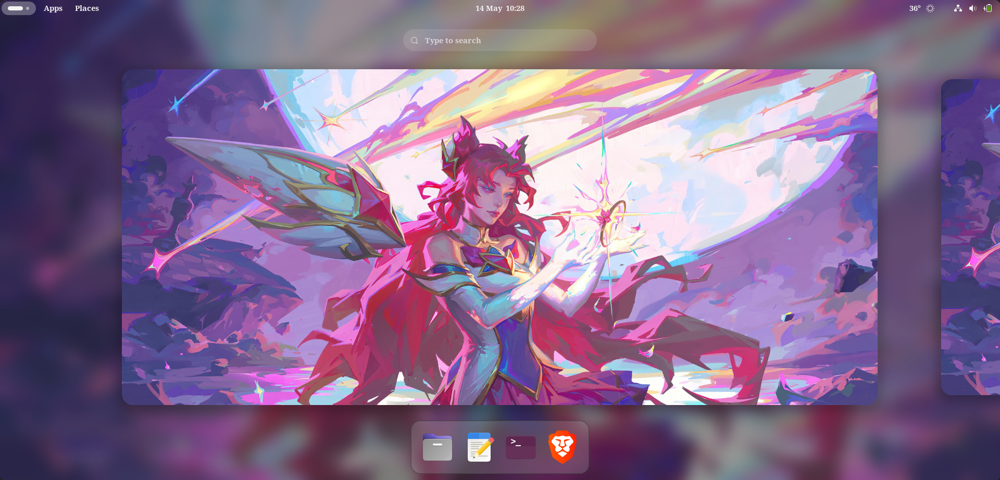
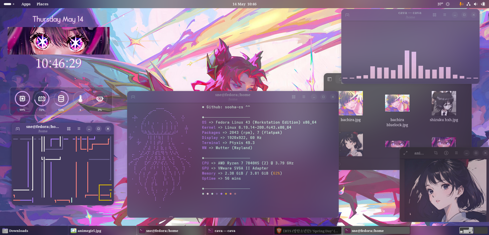
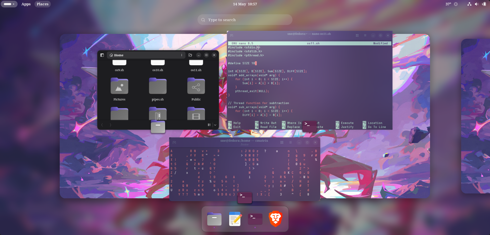
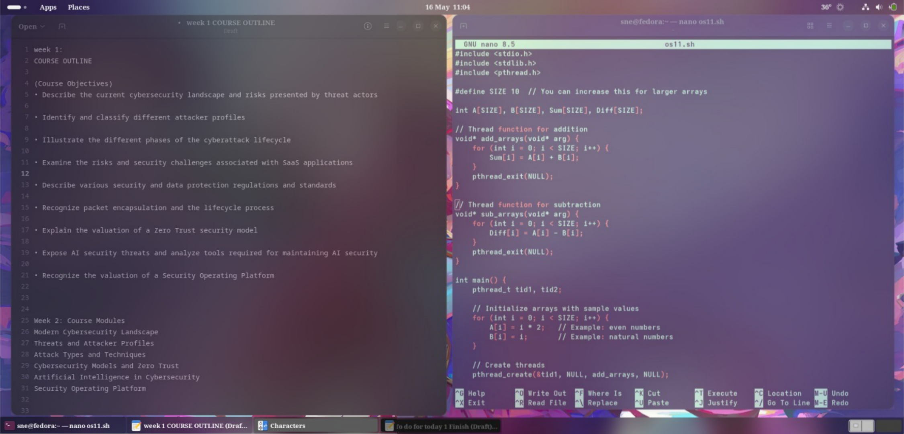

<div align="center">

# Riverfield ⋆｡˚🪼🫧˚｡⋆

A personal GNOME setup guide for Fedora. Clean, functional, and easy to replicate.



</div>

---

### Table of Contents
- [Before You Start](#before-you-start)
- [Introduction](#introduction)
- [Preview](#preview)
- [Appearance](#appearance)
  - [System & Icon Theme (Yaru)](#system--icon-theme-yaru)
  - [Wallpaper](#wallpaper)
  - [Fonts](#fonts)
- [Extensions](#extensions)
  - [Must Have](#must-have)
  - [Optional](#optional)
  - [Extension Configurations](#extension-configurations)
- [Setup Guide](#setup-guide)
- [Applications & Widgets](#applications--widgets)
  - [Terminal (Ptyxis)](#terminal-ptyxis)
  - [Fastfetch](#fastfetch)
  - [Cava (Audio Visualizer)](#cava-audio-visualizer)
  - [Clock & Date Widget](#clock--date-widget)
  - [System Stats Widget](#system-stats-widget)
  - [Weather Widget](#weather-widget)
- [Extras](#extras)
  - [Alt + Drag Windows](#alt--drag-windows)
  - [Cmatrix](#cmatrix)
- [Troubleshooting](#troubleshooting)
- [System Info](#system-info)

---

<div align="left">

## Introduction

This is my personal GNOME setup on Fedora; probably documented so I can rebuild it after inevitably breaking something :D

Riverfield is not a heavy transformation. It keeps the GNOME workflow intact while fixing the things that feel rough out of the box: fonts, blur, the dock, the launcher, a few widgets on the desktop. Everything has a reason to be here.

**New to Linux or GNOME?** If you can copy and paste a terminal command, you can follow this guide. Each step is explained and the screenshots show you exactly what settings to use.

You can get the full setup running in about **1–2 hours**, or just take the parts you want since every section works on its own.

> **Built for Fedora Workstation with GNOME on Wayland.**

</div>

---

## Before You Start

A few things worth knowing before you begin.

- **A fresh Fedora install is ideal** but not required. An existing setup works too — just be careful with themes if you have custom ones already.
- **Basic terminal knowledge is enough.** All you need to do is copy and run commands. Nothing advanced.
- **Install extensions one at a time**, not all at once. Much easier to debug if something breaks.
- **Every section is independent.** Skip what you don't need.
- **Estimated time: 1–2 hours** for the full setup.

> [!TIP]
> Not sure where to start? Follow the [Setup Guide](#setup-guide) — it walks you through everything in order.

> [!IMPORTANT]
> The visual polish comes mostly from **configuring** extensions, not just installing them. Default settings will not get you the same result. Check the configuration screenshots carefully.

---

## Preview 








---

## Appearance

Install **GNOME Tweaks** first — it is required to apply themes and fonts.

```bash
sudo dnf install gnome-tweaks
```

---

### System & Icon Theme (Yaru)

The Yaru dark theme from Ubuntu. Clean, consistent, and actively maintained.

🔗 [github.com/ubuntu/yaru](https://github.com/ubuntu/yaru)

**Installation via package manager:**

```bash
sudo dnf install yaru-theme
```

**Manual installation:**

```bash
git clone https://github.com/ubuntu/yaru.git
mkdir -p ~/.themes ~/.icons
cd yaru
cp -r themes/Yaru* ~/.themes/
cp -r icons/Yaru* ~/.icons/
```

**Applying the theme:**

Open **GNOME Tweaks → Appearance** and set:

| Field       | Value                                       |
|-------------|---------------------------------------------|
| Icons       | `Yaru-Dark`                                 |
| Shell       | `Yaru-Dark` *(requires User Themes extension)* |
| Legacy Apps | `Yaru-Dark`                                 |

> [!TIP]
> If the theme doesn't appear in Tweaks, run `gtk-update-icon-cache ~/.local/share/icons/` to refresh the cache.

---

### Wallpaper

The wallpaper used in this setup is **Star Guardian Xayah** fan art from League of Legends.

Right-click the desktop → **Change Background** → select your image, or use GNOME Settings → Background.

To set a wallpaper via terminal:

```bash
gsettings set org.gnome.desktop.background picture-uri "file:///path/to/wallpaper.png"
gsettings set org.gnome.desktop.background picture-uri-dark "file:///path/to/wallpaper.png"
```

---

### Fonts

The setup uses the **Ubuntu** font family for a clean, modern look.

🔗 [fonts.google.com/specimen/Ubuntu](https://fonts.google.com/specimen/Ubuntu)

**Installation:**

1. Download the font zip from Google Fonts.
2. Extract it.
3. Double-click any `.ttf` file → click **Install** in GNOME Font Viewer.

*Or via terminal:*

```bash
mkdir -p ~/.local/share/fonts
cp *.ttf ~/.local/share/fonts/
fc-cache -fv
```

**Applying in GNOME Tweaks → Fonts:**

| Usage          | Font            |
|----------------|-----------------|
| Interface Text | `Ubuntu`        |
| Document Text  | `Ubuntu Medium` |
| Monospace Text | `Monospace`     |

---

## Extensions

Extensions handle most of the visual and workflow improvements. Install from [extensions.gnome.org](https://extensions.gnome.org) or use **Extension Manager** from Flathub.

**Install Extension Manager:**

```bash
flatpak install flathub com.mattjakeman.ExtensionManager
```

---

### Must Have

These are the core extensions. Install these first.

- [**Blur My Shell**](https://extensions.gnome.org/extension/3193/blur-my-shell/) — Adds blur to the overview, panel, and dash. The single biggest visual change.
- [**Dash to Dock**](https://extensions.gnome.org/extension/307/dash-to-dock/) — Turns the GNOME dash into a proper persistent dock.
- [**User Themes**](https://extensions.gnome.org/extension/19/user-themes/) — Required to apply a custom Shell theme like Yaru-Dark.
- [**Just Perfection**](https://extensions.gnome.org/extension/3843/just-perfection/) — Fine-tunes and hides GNOME Shell UI elements.
- [**AppIndicator & KStatusNotifierItem Support**](https://extensions.gnome.org/extension/615/appindicator-support/) — Adds system tray icon support.
- [**Caffeine**](https://extensions.gnome.org/extension/517/caffeine/) — Prevents the screen from going to sleep.

---

### Optional

Install only what fits your workflow.

- [**ArcMenu**](https://extensions.gnome.org/extension/3628/arcmenu/) — Replaces the default app grid with a proper application launcher.
- [**GSConnect**](https://extensions.gnome.org/extension/1319/gsconnect/) — Phone and desktop sync via KDE Connect.
- [**GTK4 Desktop Icons NG (DING)**](https://extensions.gnome.org/extension/5263/gtk4-desktop-icons-ng-ding/) — Desktop icon support.
- [**Forge Tiling**](https://extensions.gnome.org/extension/4481/forge/) — Manual tiling window manager. Useful if you work with many windows.
- [**Tiling Shell**](https://extensions.gnome.org/extension/7065/tiling-shell/) — Auto tiling with screen edge snapping. Pick either this or Forge, not both.
- [**Quick Settings Audio Panel**](https://extensions.gnome.org/extension/5940/quick-settings-audio-panel/) — Better audio controls in the quick settings panel.
- [**Hide Top Bar**](https://extensions.gnome.org/extension/545/hide-top-bar/) — Auto-hides the top panel for more screen space.
- [**Top Bar Organiser**](https://extensions.gnome.org/extension/4356/top-bar-organizer/) — Controls what appears in the top bar and in what order.
- [**Compiz Magic Lamp Effect**](https://extensions.gnome.org/extension/3740/compiz-alike-magic-lamp-effect/) — Smooth minimize animation. Pure visual.
- [**Extension List**](https://extensions.gnome.org/extension/3088/extension-list/) — Manage extensions directly from the panel.
- [**Internet Speed Meter**](https://extensions.gnome.org/extension/2980/internet-speed-meter/) — Live internet speed in the top bar.
- [**Yaru Automatic Dark Mode**](https://extensions.gnome.org/extension/8655/yaru-automatic-dark-mode/) — Automatically switches between Yaru light and dark based on system setting.

---
### Extension Configurations
 
> If a setting isn't mentioned here, I left it at the default.
 
<details>
<summary><b>Blur My Shell</b></summary>
Go to **Blur My Shell settings → Pipelines** and make sure the default pipeline is enabled — it is disabled out of the box, which is the most common reason blur doesn't work.
 
Key settings to change from defaults:
 
- **Panel** — Enable blur on the top panel
- **Overview** — Enable blur in the activities overview
- **Dash** — Enable blur on the dash / dock
- **Applications** — Enable the application pipeline if you want blur behind apps like Zen Browser
</details>
<details>
<summary><b>Dash to Dock</b></summary>
- **Position:** Bottom, centered
- **Intelligent autohide:** On (hides when a window overlaps)
- **Panel mode:** Off (floating dock, not full width)
- **Icon size:** 40–48 px depending on your screen
- **Appearance:** Match the system theme, enable background blur
</details>
<details>
<summary><b>Just Perfection</b></summary>
Useful things to tweak here:
 
- Hide the **Activities button** if you don't use it
- Adjust **workspace switcher size** in the overview
- Set **animation speed** (50–75% is noticeably snappier)
- Hide the **window picker close button** for a cleaner look
</details>
<details>
<summary><b>User Themes</b></summary>
Once installed and enabled, go to **GNOME Tweaks → Appearance → Shell** and you will now see the Shell dropdown. Select `Yaru-Dark`.
 
</details>
<details>
<summary><b>AppIndicator Support</b></summary>
No configuration needed. Install and enable it — system tray icons will appear in the top bar automatically.
 
</details>

---
## Setup Guide
 
Step-by-step walkthrough from a fresh Fedora install.
 
**1. Update the system**
 
```bash
sudo dnf upgrade --refresh
```
 
**2. Install GNOME Tweaks and Extension Manager**
 
```bash
sudo dnf install gnome-tweaks
flatpak install flathub com.mattjakeman.ExtensionManager
```
 
**3. Install Yaru theme**
 
```bash
sudo dnf install yaru-theme
```
 
**4. Install the Ubuntu font**
 
Download from [fonts.google.com/specimen/Ubuntu](https://fonts.google.com/specimen/Ubuntu), extract, and install via Font Viewer.
 
**5. Apply theme and fonts**
 
Open GNOME Tweaks and set the icon theme, shell theme, and fonts as described in the [Appearance](#appearance) section.
 
**6. Install extensions**
 
Open Extension Manager and install everything in [Must Have](#must-have), then any [Optional](#optional) ones you want. Configure each using the screenshots in [Extension Configurations](#extension-configurations).
 
**7. Set your wallpaper**
 
Right-click the desktop → Change Background, or use the terminal method in [Wallpaper](#wallpaper).
 
**8. Install applications and widgets**
 
Follow the [Applications & Widgets](#applications--widgets) section below.
 
> [!NOTE]
> If GNOME Shell seems unresponsive after installing extensions, press `Alt + F2`, type `r`, and press Enter to restart the shell. On Wayland, log out and back in instead.
 
---
 

## Applications & Widgets

### Terminal (Ptyxis)

Ptyxis is the default terminal in Fedora 41+. It supports container-aware sessions (Toolbox, Distrobox) natively and looks clean with no extra configuration.

```bash
sudo dnf install ptyxis
```

For a minimal look, open Preferences and select the **Linux** profile as your default.

---

### Fastfetch

Neofetch is no longer available in Fedora repositories as of late 2024. Use Fastfetch instead — it is faster and actively maintained.

```bash
sudo dnf install fastfetch
```

Run it:

```bash
fastfetch
```

To run it automatically when a terminal opens, add `fastfetch` to the end of your `~/.bashrc` or `~/.zshrc`.

---

### Cava (Audio Visualizer)

Cava is a terminal-based audio visualizer. It reads audio output and draws a live bar chart in the terminal. Looks great in a floating terminal on the desktop.

```bash
sudo dnf install cava
```

Run it:

```bash
cava
```

**Tip:** Open a Ptyxis terminal, run `cava`, and position it on your desktop for a live visualizer effect as seen in the preview screenshots.

---

### Pipes.sh

A terminal screensaver that draws animated pipes across the screen. Looks great running in a floating terminal on the desktop.

🔗 [github.com/pipeseroni/pipes.sh](https://github.com/pipeseroni/pipes.sh)

**Installation:**

```bash
sudo dnf install pipes-sh
```

**Run it:**

```bash
pipes.sh
```

> [!TIP]
> Press `r` to reset the screen, `p` to pause, and `q` to quit. You can also tweak the speed and style with flags — run `pipes.sh --help` to see all options.

---

### Clock & Date Widget

The clock and date panel on the left side of the desktop is provided by the **Clock Widget** GNOME extension.

1. Open Extension Manager
2. Go to the **Browse** tab
3. Search for `Clock Widget` 
4. Click Install
5. Configure the position and format in its settings

---

### System Stats Widget

The row of icons showing CPU, RAM, and storage usage is a system monitor widget extension.

1. Open Extension Manager
2. Search for `Vitals` or `iStat Menus` style extensions — **Vitals** is recommended
3. Install and configure which stats to show and where they appear

🔗 [extensions.gnome.org/extension/1460/vitals](https://extensions.gnome.org/extension/1460/vitals/)

---

### Weather Widget

The weather panel visible in the screenshots is provided by a GNOME extension that pulls data from Open-Meteo (no API key required).

1. Open Extension Manager
2. Search for `Weather O'Clock` or `OpenWeather Refined`
3. Install and set your location in the extension settings

🔗 [extensions.gnome.org/extension/5660/weather-oclock](https://extensions.gnome.org/extension/5660/weather-oclock/)

The widget shows current temperature, a 7-day forecast, wind speed, humidity, and sunset time.

---

## Extras

Small additions that noticeably improve the daily experience.

---

### Alt + Drag Windows

By default, you can only move a window by grabbing its titlebar.
These two commands let you hold `Alt` and click anywhere on a window to drag or resize it.

```bash
gsettings set org.gnome.desktop.wm.preferences mouse-button-modifier '<Alt>'
gsettings set org.gnome.desktop.wm.preferences resize-with-right-button true
```

To switch windows across all workspaces instead of just the current one:

```bash
gsettings set org.gnome.shell.window-switcher current-workspace-only false
```

---

### Cmatrix

For the classic falling-characters terminal effect visible in the screenshots.

```bash
sudo dnf install cmatrix
```

Run it:

```bash
cmatrix
```

---


## Troubleshooting

> [!NOTE]
> These are the most common issues. Check here before anything else.

---

**Extensions not showing after install**

> [!TIP]
> Restart GNOME Shell without logging out:
> ```
> Alt + F2 → type 'r' → press Enter
> ```
> On Wayland, log out and log back in.

---

**Shell theme not appearing in GNOME Tweaks**

> [!IMPORTANT]
> The **User Themes** extension must be installed and enabled first.
> The Shell dropdown will not appear without it.

---

**Blur My Shell not doing anything**

> [!TIP]
> Go to Blur My Shell settings → **Pipelines** tab.
> The default pipeline is disabled out of the box. Enable it manually.

---

**Yaru theme not showing after installation**

> [!TIP]
> Refresh the icon cache:
> ```bash
> gtk-update-icon-cache ~/.local/share/icons/
> ```

---

**Fastfetch not found**

> [!TIP]
> Make sure you are on Fedora 41 or later, or enable the COPR repository:
> ```bash
> sudo dnf copr enable fastfetch-linux/fastfetch
> sudo dnf install fastfetch
> ```

---

## System Info

This setup was built and tested on:

| Component | Value                            |
|-----------|----------------------------------|
| OS        | Fedora Linux 43 (Workstation)    |
| Kernel    | Linux 6.19.14-200.fc43.x86_64   |
| Display   | 1920×922, 60 Hz                  |
| Terminal  | Ptyxis 49.3                      |
| WM        | Mutter (Wayland)                 |
| CPU       | AMD Ryzen 7 7840HS               |

---

## Directory Structure

```text
.
├── Assets/
│   ├── desktop.png
│   ├── overview.png
│   ├── preview.png
│   └── workflow.png
└── README.md
```

| System Path                      | Purpose                  |
|----------------------------------|--------------------------|
| `~/.local/share/icons/`          | Cursor and icon themes   |
| `~/.themes/`                     | GTK themes               |
| `~/.local/share/sounds/`         | Sound themes             |
| `~/.local/share/fonts/`          | Custom fonts             |

---

<div align="center">

*Built through a lot of trial, tweaks, and reboots.*

</div>
